##  :vertical_traffic_light: 启发式算法解决广义旅行商问题

#### 简介

使用 <u>模拟退火</u>、<u>禁忌搜索</u>、<u>遗传算法</u>和<u>蚁群算法</u>共四种启发式算法来解决**广义旅行商问题**

#### 问题实例

[问题实例链接](./GTSP_instance.md)

- GTSP(9,5) GTSP(17,11) GTSP(24,15) GTSP(31,16)  GTSP(39,25)

#### 算法流程

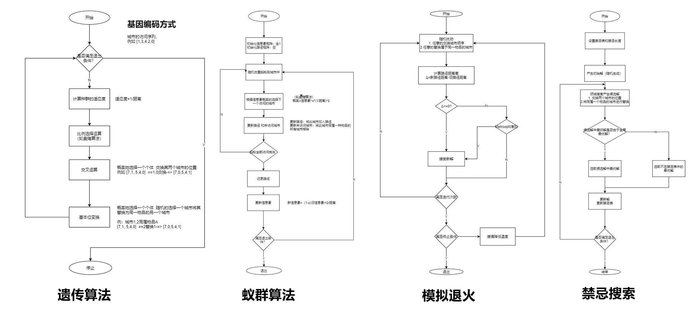

#### 结果分析

##### 复杂度

> 针对五种GTSP实例，分别迭代100000次，计算其运行时间

| 时间\s | 遗传算法 | 蚁群算法 | 模拟退火 | 禁忌搜索 |
| ---- | -------- | -------- | -------- | -------- |
|**GTSP(9,5)**| 215.1 | 1135.8 | 23.75 | 41.35 |
|**GTSP(17,11)**| 291.5 | 4629.4 | 25.61 | 336.3 |
|**GTSP(24,15)**| 416.3 | 8874.4 | 37.50 | 510.8 |
|**GTSP(31,16)**| 522.7 | 11344.5 | 40.08 | 730.5 |
|**GTSP(39,25)**| 617.2 | 15768.9 | 57.90 | 1624.0 |
|平均 | 412.56 | 8,350.6 | 36.97 | 648.58 |

##### 收敛性

> 针对五种GTSP实例，分别迭代100000次，查看其每次迭代解的路径总距离

###### GTSP(9,5)

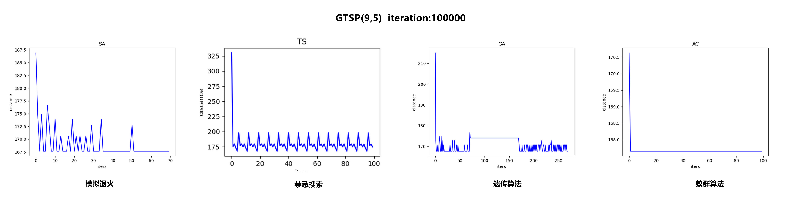

###### GTSP(17,11)

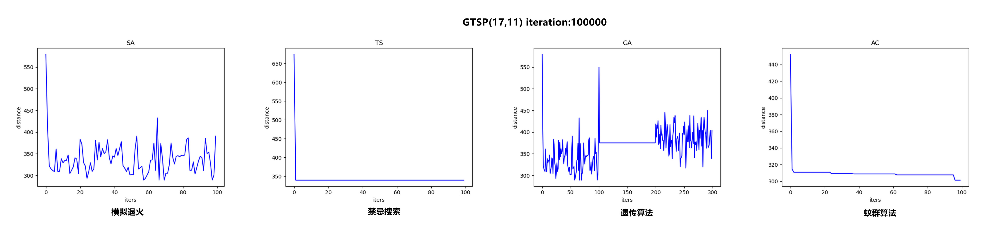

###### GTSP(24,15)

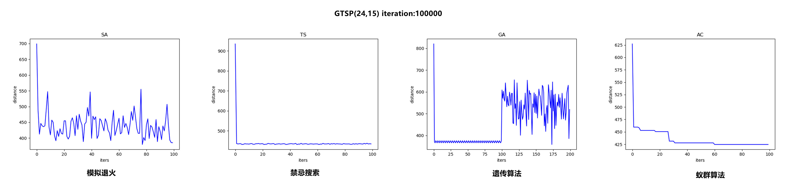

###### GTSP(31,16)

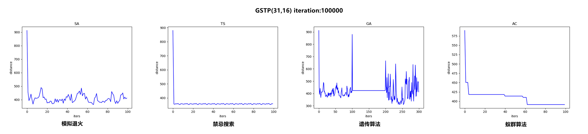

###### GTSP(39,25)

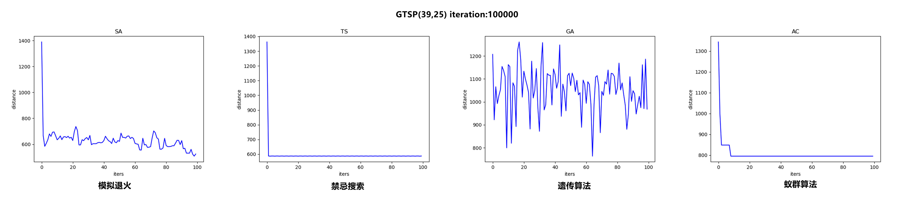

##### 解比较

> 针对五种GTSP实例，分别迭代100000次，查看最后解的效果

###### GTSP(9,5)

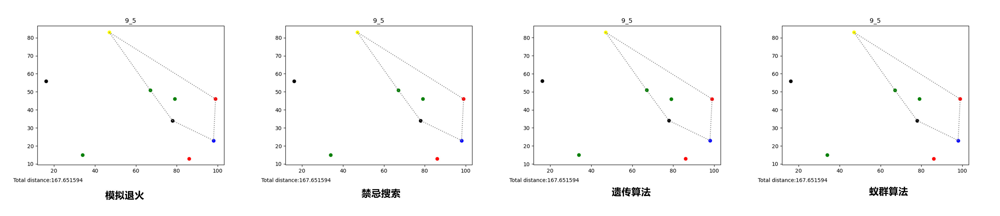

###### GTSP(17,11)

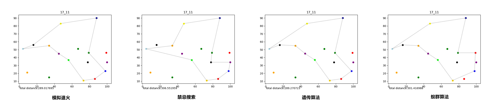 

###### GTSP(24,15)

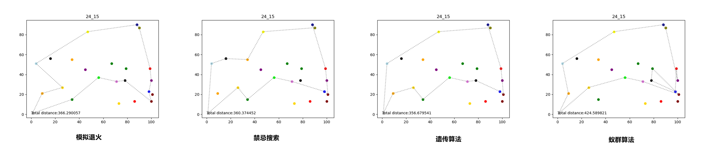

###### GTSP(31,16)

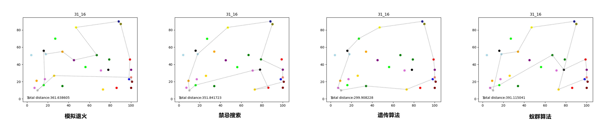

###### GTSP(39,25)

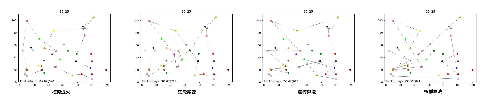